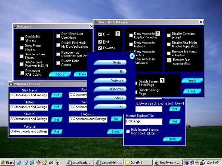



## ^A Registry Tweaker with Cool Looks^

### Description

RegTweak is a utility for configuring windows by modifying registry. Has a gool graphica interface and offers four levels of control. A few enhancements are to be done.if this is good RATE THIS PROGRAM
 
### More Info
 

             |
---                |---
**Submitted On**   |2002-12-27 00:37:02
**By**             |[Ananth\. G](https://github.com/Planet-Source-Code/PSCIndex/blob/master/ByAuthor/ananth-g.md)
**Level**          |Intermediate
**User Rating**    |4.6 (32 globes from 7 users)
**Compatibility**  |VB 6\.0
**Category**       |[Complete Applications](https://github.com/Planet-Source-Code/PSCIndex/blob/master/ByCategory/complete-applications__1-27.md)
**World**          |[Visual Basic](https://github.com/Planet-Source-Code/PSCIndex/blob/master/ByWorld/visual-basic.md)
**Archive File**   |[RegTweak15184512252002\.zip](https://github.com/Planet-Source-Code/ananth-g-a-registry-tweaker-with-cool-looks__1-41855/archive/master.zip)

